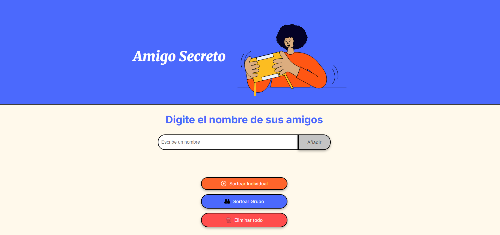

# Challenge-AmigoSecreto
# Amigo Secreto 🎁

Este es un proyecto simple para realizar un sorteo de **Amigo Secreto** de manera aleatoria entre una lista de participantes ingresados por el usuario.

## 📋 Descripción

El programa permite:
- Ingresar nombres de participantes.
- Mostrar la lista actual de participantes.
- Realizar el sorteo de manera aleatoria.
- Mostrar el amigo secreto asignado.

## 🚀 Cómo usar

1. Ejecuta el programa.
2. Ingresa el nombre de cada participante y haz clic en "Añadir".
3. Cuando hayas terminado, presiona el botón de "Sortear Amigo".
4. El sistema seleccionará un participante al azar y mostrará el resultado.

## 📂 Estructura del proyecto

├── index.html # Estructura base de la interfaz
├── style.css # Estilos de la aplicación
└── script.js # Lógica del programa

## 💻 Tecnologías utilizadas
- **HTML5** para la estructura.
- **CSS3** para los estilos.
- **JavaScript** para la lógica del sorteo.

## 🖼 Vista previa

## ✨ Autor
Proyecto desarrollado como parte de un **challenge individual**.
